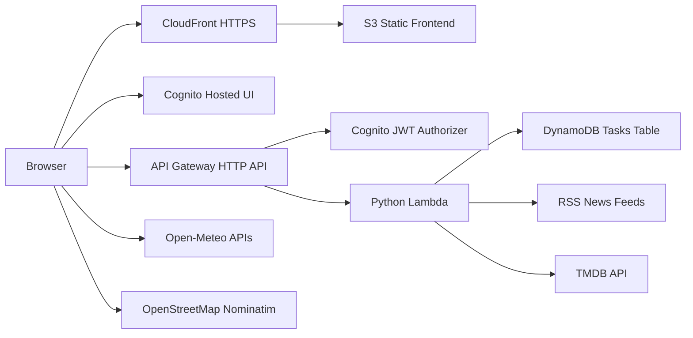

# Architecture

## System Goal

Personal Toolkit is a serverless personal dashboard that demonstrates authenticated multi-user data access, AWS infrastructure as code, and CI/CD delivery. The application is intentionally small in product scope but production-oriented in its architecture.

## High-Level Diagram



## Request Flow

1. The user opens the CloudFront URL.
2. CloudFront serves the static SPA from S3.
3. The frontend redirects unauthenticated users to Cognito Hosted UI.
4. Cognito returns an authorization code to the configured callback URL.
5. The frontend exchanges the code using PKCE and stores tokens in `sessionStorage`.
6. Protected API calls include `Authorization: Bearer <access_token>`.
7. API Gateway validates JWTs with the Cognito authorizer.
8. Lambda reads the verified Cognito `sub` claim from the authorizer context.
9. Task data is read and written under `PK = USER#{sub}` in DynamoDB.
10. News and movies are fetched by Lambda from external providers.

## Security Model

The backend does not trust user IDs from the request body or query string. User ownership is derived only from API Gateway's verified JWT claims.

```text
Cognito sub -> API Gateway authorizer claims -> Lambda -> DynamoDB PK
```

This prevents one authenticated user from reading or mutating another user's tasks.

Other security properties:

- SPA OAuth flow uses Authorization Code with PKCE.
- Cognito app client has no client secret.
- API Gateway routes require JWT authorization.
- TMDB API key is injected into Lambda through SAM parameters and GitHub Secrets.
- Production Cognito callback/logout URLs use HTTPS through CloudFront.
- Local `http://localhost:8000` callback URLs are allowed only for development.

## Data Model

Tasks are stored in DynamoDB with a composite key:

```text
PK = USER#{cognitoSub}
SK = TASK#{taskId}
```

This makes user isolation the primary access pattern. All task updates and deletes use the authenticated user's `PK`, so a valid task ID alone is not sufficient to access another user's item.

## Infrastructure

The active backend infrastructure is defined in `infra/template.yaml` and deployed with AWS SAM:

- DynamoDB table for task persistence.
- Cognito user pool, Hosted UI domain, and SPA app client.
- API Gateway HTTP API with a Cognito JWT authorizer.
- Python 3.13 Lambda function.
- IAM permissions for Lambda to access the task table.

The frontend is hosted separately:

- S3 bucket stores static assets from `frontend/`.
- CloudFront serves the SPA over HTTPS.
- CloudFront invalidation runs after frontend deployment.

## CI/CD

### CI Workflow

`.github/workflows/ci.yml` runs on pushes and pull requests:

```text
python3 -m unittest discover -s tests
python3 -m py_compile ...
node --check frontend/app.js
sam validate --template-file infra/template.yaml
sam build --template-file infra/template.yaml
```

This validates application behavior, frontend syntax, and infrastructure buildability before deployment.

### Backend Deployment

`.github/workflows/deploy-backend.yml` is manually triggered. It:

1. Configures AWS credentials from GitHub Secrets.
2. Validates Cognito callback/logout URL schemes.
3. Runs `sam build`.
4. Runs `sam deploy`.
5. Prints CloudFormation stack outputs.

### Frontend Deployment

`.github/workflows/deploy-frontend.yml` is manually triggered. It:

1. Configures AWS credentials from GitHub Secrets.
2. Checks `frontend/app.js`.
3. Syncs `frontend/` to S3.
4. Invalidates the CloudFront distribution.
5. Prints the S3 and CloudFront URLs.

## Operational Notes

- The CloudFront URL should be used as the production callback/logout URL in Cognito.
- The S3 website endpoint is `http://` and cannot be used directly as a Cognito production callback URL.
- `frontend/config.js` must be updated with SAM outputs after backend changes.
- `config.example.js` is excluded from frontend deployment.
- `.aws-sam/` is a generated build directory and is ignored by Git.

## Future Hardening

- Replace long-lived AWS access keys with GitHub OIDC federation.
- Add least-privilege IAM policies for deployment.
- Restrict CORS origins to the CloudFront domain.
- Add CloudWatch structured logging, metrics, dashboards, and alarms.
- Add Playwright end-to-end tests for authentication and task CRUD flows.
