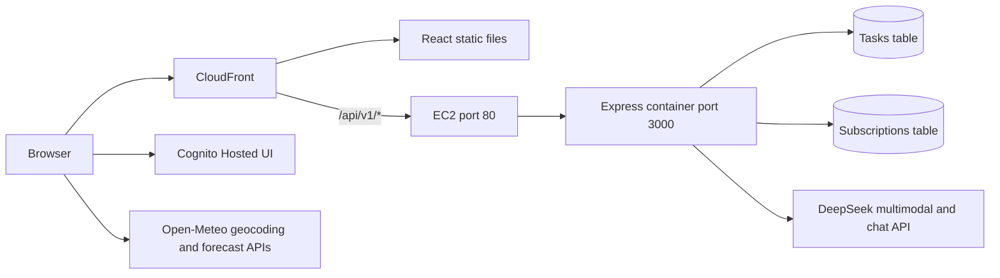
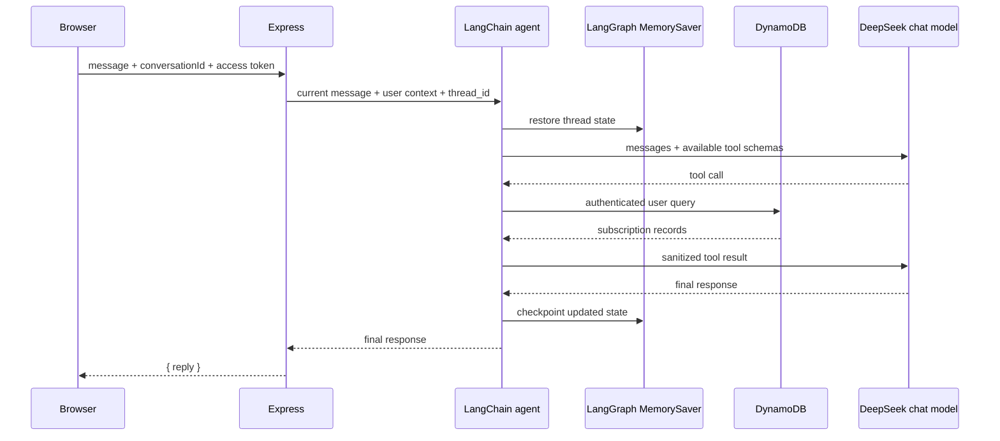
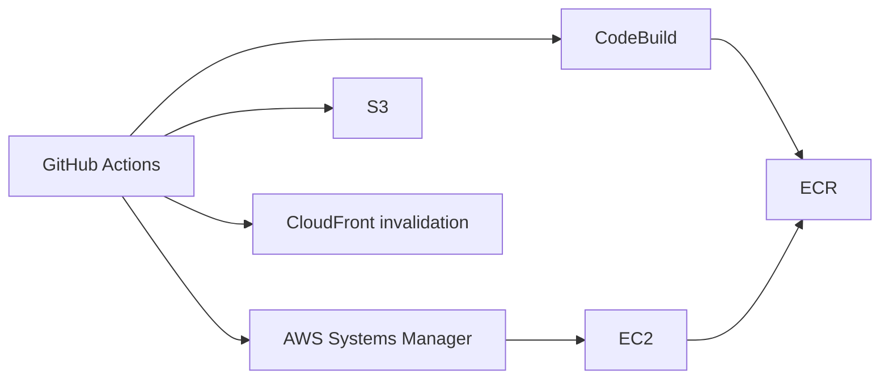

# SubLens architecture

## Runtime architecture


```mermaid
flowchart LR
  Browser --> CloudFront
  CloudFront --> S3[React static files]
  CloudFront -->|/api/v1/*| EC2[EC2 port 80]
  EC2 --> Docker[Express container port 3000]
  Browser --> Cognito[Cognito Hosted UI]
  Docker --> Tasks[(Tasks table)]
  Docker --> Subscriptions[(Subscriptions table)]
  Docker --> DeepSeek[DeepSeek multimodal and chat API]
  Browser --> OpenMeteo[Open-Meteo geocoding and forecast APIs]
```

## Authenticated request flow

1. CloudFront serves the React application from S3.
2. React starts the Cognito Authorization Code flow with PKCE.
3. Cognito redirects back to the SPA with an authorization code.
4. React exchanges the code for tokens and sends the access token in the `Authorization` header.
5. CloudFront forwards `/api/v1/*` to the EC2 origin.
6. Express verifies the access token with `aws-jwt-verify` and stores its `sub` on the request.
7. Route handlers use that verified `sub` to read or write the current user's DynamoDB records.

The API never trusts a browser-supplied user ID.

## Screenshot analysis flow

1. The browser previews the selected image locally.
2. React uploads it as the `screenshot` field in `multipart/form-data`.
3. Multer stores the uploaded file in memory.
4. Express queries the user's current subscriptions.
5. The image and existing subscription records are sent to the multimodal model.
6. The model returns structured subscription fields and an optional similar-subscription warning.
7. React lets the user correct the fields before a separate save request writes the record to DynamoDB.

The DeepSeek API key exists only in the backend container. Screenshot content and the user's current subscription records are shared with the AI provider when analysis is requested.

## Conversational agent flow

1. React creates a UUID for the current browser conversation and sends it with each message.
2. Express authenticates the request and combines the verified Cognito `sub` with the conversation UUID to form the LangGraph `thread_id`.
3. The LangChain agent receives only the current user message; its checkpointer restores earlier state for the same thread.
4. The model selects from Zod-described, read-only tools instead of receiving unrestricted database access.
5. A tool uses `runtime.context.userId` to query only the authenticated user's DynamoDB records.
6. Internal DynamoDB keys are removed before tool results are returned to the model.
7. The model turns the tool result into the final user-facing response, and React appends it to the chat panel.


```mermaid
sequenceDiagram
  participant Browser
  participant Express
  participant Agent as LangChain agent
  participant Memory as LangGraph MemorySaver
  participant DB as DynamoDB
  participant Model as DeepSeek chat model

  Browser->>Express: message + conversationId + access token
  Express->>Agent: current message + user context + thread_id
  Agent->>Memory: restore thread state
  Agent->>Model: messages + available tool schemas
  Model-->>Agent: tool call
  Agent->>DB: authenticated user query
  DB-->>Agent: subscription records
  Agent->>Model: sanitized tool result
  Model-->>Agent: final response
  Agent->>Memory: checkpoint updated state
  Agent-->>Express: final response
  Express-->>Browser: { reply }
```

The current `MemorySaver` is intentionally process-local: it supports follow-up questions while the backend process remains alive, but it is not durable across container replacements or server restarts. The `conversationId` is not an authorization boundary; DynamoDB access always uses the verified Cognito user ID supplied through runtime context.

## Data model

```text
Tasks table
PK = USER#{cognitoSub}
SK = TASK#{taskId}

Subscriptions table
PK = USER#{cognitoSub}
SK = SUBS#{subscriptionId}
```

The Express CloudFormation stack creates the tasks table. The subscriptions table name is supplied to that stack as a parameter, and the EC2 role receives access to it.

## AWS stacks and resources

The `personal-toolkit` stack contains Cognito resources:

- User Pool
- Hosted UI domain
- Public SPA app client

The `clouddesk-express` stack contains backend resources:

- EC2 instance and Elastic IP
- Security group and EC2 instance role
- ECR repository
- DynamoDB tasks table
- Private S3 deployment bucket
- CodeBuild project and IAM role

The frontend uses an existing S3 website bucket and CloudFront distribution.

## Deployment flow


```mermaid
flowchart LR
  GitHub[GitHub Actions] --> CodeBuild
  CodeBuild --> ECR
  GitHub --> SSM[AWS Systems Manager]
  SSM --> EC2
  EC2 --> ECR
  GitHub --> S3
  GitHub --> CloudFront[CloudFront invalidation]
```

- The backend workflow uploads build input to the private deployment bucket.
- CodeBuild creates and pushes the Docker image to ECR.
- Systems Manager tells EC2 to pull the image and replace the running container.
- The frontend workflow builds Vite, syncs `dist/` to S3, and invalidates CloudFront.

The deployment does not use Lambda, API Gateway, nginx, an Application Load Balancer, or a NAT Gateway.
