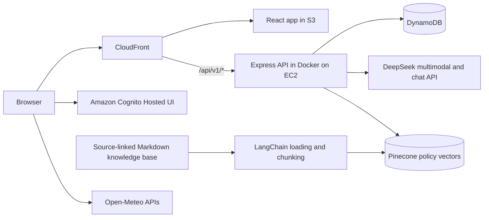

# SubLens

[](https://github.com/MingtanSun/personal-toolkit-aws/actions/workflows/ci.yml)

SubLens is an AI-assisted subscription tracker and personal dashboard built as a full-stack AWS portfolio project. It combines multimodal subscription extraction, a LangChain-powered tool-using agent, Pinecone-backed retrieval-augmented generation (RAG), and human-in-the-loop approval for database-changing actions.

**Live demo:** [https://d1l863cphghqlg.cloudfront.net/](https://d1l863cphghqlg.cloudfront.net/)

## Highlights

- Upload and preview PNG, JPEG, or WebP subscription screenshots.
- Extract service, plan, billing cycle, amount, currency, first payment date, website, and notes with a multimodal DeepSeek model.
- Compare a new screenshot with the user's saved subscriptions and display a possible-duplicate warning.
- Review and edit AI-generated fields before saving them.
- Use a LangChain agent with eight specialized tools for spending analysis, service lookup, duplicate detection, upcoming renewals, provider-policy retrieval, amount updates, and stored-record deletion.
- Retrieve cancellation, refund, billing, invoice, trial, and plan information from a source-linked Pinecone knowledge base instead of relying on unsupported model knowledge.
- Process more than 40 Markdown knowledge documents with LangChain document loaders and `MarkdownTextSplitter`, preserving service, topic, source, retrieval date, and chunk metadata.
- Use Pinecone integrated embeddings, service-level metadata filtering, and top-k semantic retrieval to ground policy answers.
- Pause agent-initiated amount updates and stored-record deletions with LangChain human-in-the-loop middleware before either write tool executes.
- Resume approved or rejected actions through the same LangGraph thread and checkpoint.
- Continue follow-up questions within the same browser conversation through LangGraph thread-scoped short-term memory.
- Limit model calls per run and conversation to reduce unintended token usage.
- Create, update, filter, star, prioritize, and delete personal tasks.
- View current conditions and a five-day forecast, with Ottawa as the default and city search powered by Open-Meteo.
- Sign in through Amazon Cognito using OAuth 2.0 Authorization Code with PKCE.
- Keep every user's subscriptions and tasks isolated by the verified Cognito `sub` claim.
- Deploy the React frontend through S3 and CloudFront and the Dockerized Express API on EC2.

## Architecture



The browser signs in with Cognito and sends an access token with protected API requests. Express verifies the JWT, reads the user's `sub`, and uses it to query that user's DynamoDB records. Subscription screenshots are sent to Express as `multipart/form-data`; the API keeps provider keys on the server and sends the image to the multimodal model for analysis. For conversational requests, LangChain orchestrates the DeepSeek chat model, typed subscription tools, policy retrieval, and database operations. LangGraph provides thread-scoped checkpoints and resumable human approval, while Pinecone performs metadata-filtered semantic retrieval over source-linked provider documentation.

See [ARCHITECTURE.md](./ARCHITECTURE.md) for the complete request and deployment flow.

## Agent, RAG, and human approval

The conversational assistant separates three kinds of work:

1. Personal subscription questions use authenticated DynamoDB tools.
2. Provider-policy questions use a Pinecone-backed RAG tool.
3. Database-changing actions require human approval before execution.

```text
User message
    |
    v
LangChain agent
    |-- Stored subscription question --> DynamoDB read tool
    |-- Provider policy question ------> Pinecone RAG tool
    `-- Update or deletion ------------> DynamoDB write tool
                                             |
                                             v
                                        HITL interrupt
                                             |
                                             v
                                   User replies yes or no
                                             |
                                             v
                                      Approve or reject
```

The policy knowledge base currently covers 11 subscription providers across more than 40 source-linked Markdown documents. An ingestion pipeline loads the documents, extracts metadata, splits long Markdown content into overlapping chunks, and uploads the records to the `knowledge-v1` Pinecone namespace.

At query time, the RAG tool sends the user's policy question to the Pinecone index, filters results by subscription provider, and returns the three most relevant passages. DeepSeek then produces a concise answer grounded in the retrieved content and its source URL.

For amount updates and stored-record deletions, the model first identifies the exact subscription record and proposes a write-tool call. LangChain's human-in-the-loop middleware intercepts the call before execution. LangGraph checkpoints the pending action under the authenticated user's thread ID and resumes it only after the user explicitly replies `yes`; replying `no` rejects the operation.

## Technology stack

| Layer | Technologies |
| --- | --- |
| Frontend | React 19, Vite 7, JavaScript, CSS |
| Backend | Node.js, Express 5, TypeScript, Multer |
| Authentication | Amazon Cognito, OAuth 2.0 Authorization Code + PKCE, `aws-jwt-verify` |
| Operational data | Amazon DynamoDB, AWS SDK for JavaScript v3 |
| Knowledge retrieval | Pinecone vector database, integrated embeddings, metadata filtering, top-k semantic search |
| Agent framework | LangChain `createAgent`, typed tools, human-in-the-loop middleware, model-call limits |
| Agent state | LangGraph SQLite checkpointer, thread-scoped checkpoints, resumable interrupts |
| Document processing | LangChain document loaders, `MarkdownTextSplitter`, metadata-enriched chunking |
| Models | DeepSeek multimodal and OpenAI-compatible chat APIs |
| Validation | Zod tool and runtime-context schemas |
| Cloud | EC2, Docker, ECR, S3, CloudFront, CodeBuild, Systems Manager, IAM |
| Delivery | GitHub Actions, AWS SAM, CloudFormation |

## Repository structure

```text
frontend-react/       React and Vite frontend
backend-express/      Express and TypeScript API
infra/                Cognito SAM/CloudFormation template
infra-express/        EC2, ECR, DynamoDB, IAM, S3, and CodeBuild template
.github/workflows/    CI and manual deployment workflows
archive/              Retired implementation notes kept for reference
```

The current application uses the Express backend. The previous Lambda and API Gateway implementation has been removed from the active architecture.

## API routes

```text
GET    /health

GET    /api/v1/tasks
POST   /api/v1/tasks
PATCH  /api/v1/tasks/:taskId
DELETE /api/v1/tasks/:taskId

POST   /api/v1/subscription/analyze
POST   /api/v1/subscription/submit
GET    /api/v1/subscription
PUT    /api/v1/subscription
DELETE /api/v1/subscription

POST   /api/v1/agent/message
```

Every `/api/v1/*` route requires a valid Cognito access token in the `Authorization: Bearer <token>` header. `/health` is public.

## DynamoDB model

Both feature tables use a composite key. The verified Cognito user ID is part of the partition key:

```text
Tasks table
PK = USER#{cognitoSub}
SK = TASK#{taskId}

Subscriptions table
PK = USER#{cognitoSub}
SK = SUBS#{subscriptionId}
```

This lets the API query one user's data without accepting a user ID from the browser.

## Validation and deployment

Every push and pull request runs the GitHub Actions CI workflow, which installs dependencies, type-checks and builds the Express API, builds the React frontend, and validates the Cognito SAM template.

Deployment workflows are intentionally manual:

- **Deploy Cognito** updates the authentication stack.
- **Deploy Express Backend** builds a Docker image with CodeBuild, pushes it to ECR, and replaces the EC2 container through Systems Manager.
- **Deploy Frontend** builds the Vite app, syncs it to S3, and invalidates CloudFront.

Repository secrets are used for AWS credentials and `DEEPSEEK_API_KEY`; secrets are not stored in source control.

## Documentation

- [Application documentation](./APPLICATION_DOCUMENTATION.md)
- [Architecture](./ARCHITECTURE.md)
- [Technical project overview](./PROJECT_OVERVIEW.md)
- [Express API guide](./backend-express/README.md)
- [Backend infrastructure guide](./infra-express/README.md)

## Project status

SubLens is a working portfolio project with a deployed React frontend, authenticated Express API, persistent DynamoDB user data, multimodal subscription extraction, a tool-using LangChain agent, Pinecone-backed RAG, and checkpointed human approval for write operations.

Agent conversations and pending approvals use a SQLite checkpoint database inside the backend container. They survive backend process restarts while the container remains in place, but replacing the container during deployment resets them. This project intentionally does not mount a persistent volume for agent checkpoints; subscription and task data remain in DynamoDB.
